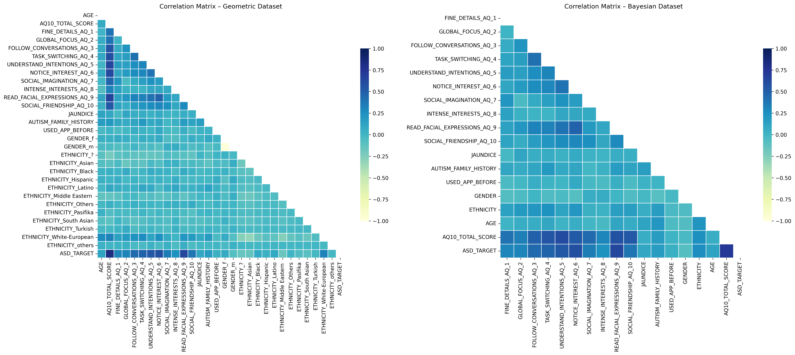
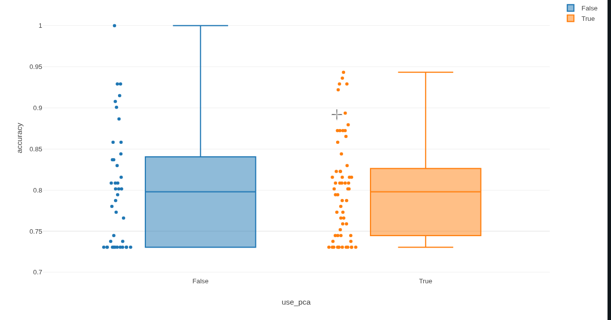
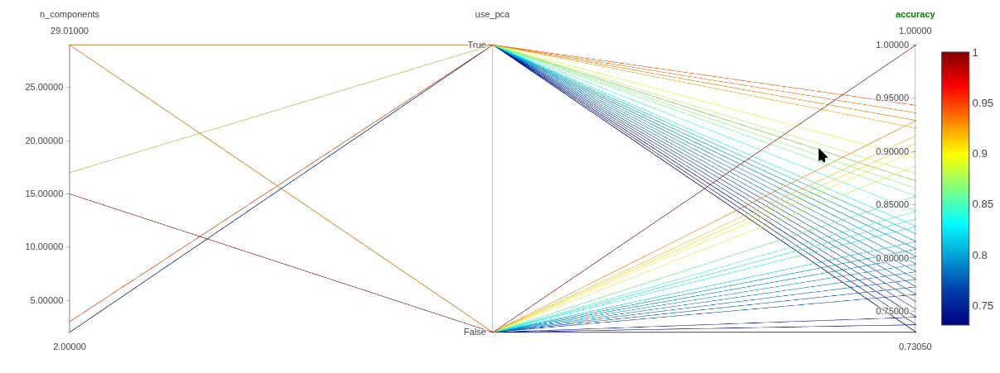

# Autism Screening Adult — Multimodal Machine Learning Repository

Introduction
------------

[Insert Project Introduction Here]

**Repository overview**
- Purpose: A structured, reproducible research pipeline to perform exploratory analysis, data engineering, and multimodal modeling for adult autism screening. The repository integrates geometric (distance-based), connectionist (ANN), probabilistic (Bayesian networks) and unsupervised (clustering) modeling paradigms, including PCA-driven dimensionality reductions and MLflow experiment tracking.
- Contents: Jupyter notebooks for each project phase, serialized preprocessing pipelines and PCA artifacts, static HTML exports of notebooks, illustrative imagery used in analytical write-ups, and MLflow experiment artifacts in `mlruns/`.

Notebook Organization
---------------------
Below follows a precise technical description of the notebooks contained in `notebooks/`. For each notebook I provide a short technical summary and the internal Table of Contents (Index) replicated verbatim as it appears inside the respective notebook file. This preserves the original analytical flow used throughout the project.

- `notebooks/1_ExploratyAnaliysis.ipynb` — Exploratory Data Analysis (EDA)
	- Technical summary: Comprehensive EDA focused on variable types, frequency statistics, visualizations for binary/questionnaire-derived features (A1–A10), demographic analysis, categorical association measures and numeric correlation analysis. This notebook prepares domain understanding and justifies the transformations and feature selections used in the preprocessing stage.
	- Internal Table of Contents (Index) — replicated exactly:
		- [1. Descripción del Dataset](#sec1)
		- [2. Data Upload](#sec2)
		- [3. Data Exploration](#sec3)
			- [3.1 Dataset structure](#sec31)
			- [3.2 Frequency Analysis](#sec32)
		- [4. Statistical Summary](#sec4)
			- [4.1 General Data Summary](#sec41)
		- [5. Data Visualization](#sec5)
		- [6. Analysis of Categorical Variables](#sec6)
		- [7. Correlation Analysis](#sec7)
			- [7.1 Correlation Numeric Analysis](#sec71)
			- [7.2 Asociacion Categorical Analysis](#sec72)
		- [8. Hipótesis Iniciales](#sec8)

- `notebooks/2_Transformations.ipynb` — Data transformations, dual-branch pipelines (geometric vs Bayesian)
	- Technical summary: Implements a dual branch preprocessing strategy: one pipeline designed for geometric models (standardization, one-hot encoding) and another for Bayesian structural learning (ordinal encoding and discrete binning). It produces two transformed datasets (geometric and Bayesian) and serializes both pipelines. The notebook documents imputation strategy, discretization rationale, and preserves domain interpretability for the Bayesian branch.
	- Internal Table of Contents (Index) — replicated exactly:
		- [1. Data Upload](#sec1)
		- [2. Dataset Transformation Table](#sec2)
			- [2.1 Dataset Variable Transformations – Geometric Models](#sec21)
			- [2.2 Dataset Variable Bayesian Network-Specific Transformations](#sec22)
		- [3. Preparing the Data Set and Variables](#sec3)
			- [3.1 Removal of Non-Relevant Variables](#sec31)
			- [3.2 Handling Missing Data](#sec32)
		- [4. Transformations](#sec4)
			- [4.1 Geometric models branch](#sec41)
			- [4.2 Bayesian Network branch](#sec42)
		- [5. Dataset Transformation](#sec5)
			- [5.1 Transformation Geometric models branch](#sec51)
			- [5.2 Transformation Bayesian Network branch](#sec52)
			- [5.3 Downloads .CSV y Pipeline](#sec53)
		- [6. Correlation analysis](#sec6)
			- [6.1 Comparation](#sec61)
			- [6.2 Results](#sec62)
		- [7. Conclusions](#sec7)

- `notebooks/3_Modeling_&&_Predictions.ipynb` — Modeling, PCA experiments, predictions and MLflow tracking
	- Technical summary: Implements the modeling experiments, including K-Nearest Neighbors (KNN), Artificial Neural Networks (ANN), Bayesian Network structure learning and inference (using bnlearn), and various clustering experiments. The notebook documents PCA exploration (2D/3D/full), selects 17 principal components for production experiments, runs comparative experiments with and without PCA, logs results and artifacts to MLflow, and demonstrates inference on three representative test cases.
	- Internal Table of Contents (Index) — replicated exactly:
		- [1. Configurations](#sec1)
			- [1.1 Dataset Upload](#sec11)
			- [1.2 MLFlow](#sec12)
		- [2. PCA](#sec2)
			- [2.1 Split and Scaling](#sec21)
			- [2.2 Explore PCA to Geometric dataset](#sec22)
			- [2.3 PCA full variables](#sec23)
			- [2.4 Select PCA to Geometric dataset](#sec24)
			- [2.5 Download PCA's and scaling](#sec25)
		- [3. Modeling phase K-Neighbors](#sec3)
			- [3.1 K-Neighbors without PCA](#sec31)
			- [3.2 K-Neighbors with PCA](#sec32)
		- [4. Modeling phase Neural Network](#sec4)
			- [4.1 Neural Network without PCA](#sec41)
			- [4.2 Neural Network with PCA](#sec42)
		- [5. Modeling phase Cluster](#sec5)
			- [5.1 PCA with 2 principal components and clustering](#sec51)
			- [5.2 PCA with 3 principal components and clustering](#sec52)
			- [5.3 PCA with 17 principal components and clustering](#sec53)
			- [5.4 Without PCA and clustering](#sec54)
		- [6. Modeling phase BNN](#sec6)
		- [7. Comparation](#sec7)
		- [8. New Samples](#sec8)
			- [8.1 Transformers and Pipelines](#sec81)
			- [8.2 New Samples Definition](#sec82)
			- [8.3 Prediction Results Summary](#sec83)
		- [9. Conclusion](#sec9)

Installation and Reproducibility
--------------------------------
This repository is designed to be reproducible. The recommended approach below uses a standard Python virtual environment and the included `requirements.txt` to install dependencies.

1. Clone the repository (replace the remote URL with your fork/clone):

```bash
git clone "https://github.com/PaulSebastian9720/Autism-screaning-adult-analysis.git"
cd "Practica 4"
```

2. Create a Python virtual environment:

```bash
python -m venv venv
```

3. Activate the environment (Linux/macOS):

```bash
source venv/bin/activate
```

4. Upgrade pip and install dependencies:

```bash
pip install --upgrade pip
pip install -r requirements.txt
```

Notes on environment:
- The `requirements.txt` included in the repository contains the dependency set used during experiments. Some packages (e.g., TensorFlow, oneDNN-enabled builds, or GPU drivers) can require platform-specific binaries or drivers.
- If you require exact reproducibility on another machine, consider exporting the environment (`pip freeze > pinned-requirements.txt`) after installation or using a container (Docker) with pinned system libraries.

Attachments & Artifacts
------------------------
The repository includes a curated `_attachments/` folder used to store datasets, serialized preprocessing artifacts, static HTML exports of notebooks, and image assets. These artifacts are intended for reproducibility, report generation and fast static inspection.

- `_attachments/datasets/`:
	- `Autism-Adult-Data.arff` — Original ARFF source file used for ingestion.
	- `data-set-bayesian-labels.csv` — Dataset transformed for Bayesian network modeling (discrete labels, ordinal encodings and discretizations applied).
	- `data-set-geometric-labels.csv` — Dataset transformed for geometric models (encoded and standardized numeric features).

- `_attachments/html/` — Static HTML exports of the notebooks (useful for quick review without launching Jupyter):
	- `1_ExploratyAnaliysis.html`
	- `2_Transformations.html`
	- `3_Modeling_&&_Predictions.html`

- `_attachments/pipelines/` — Serialized preprocessing and PCA artifacts (joblib / pickle files). These are the exact files produced by the notebooks during the transformation and PCA stages and can be loaded to reproduce transformations and inference pipelines.
	- `pipeline_bn.pkl` — Bayesian network preprocessing pipeline (imputation, ordinal encoding, discretizer).
	- `pipeline_gm.pkl` — Geometric models preprocessing pipeline (imputation, OneHotEncoder, etc.).
	- `stand_scaler.pkl` — Standard scaler used prior to PCA and geometric-model training.
	- `pca_2.pkl`, `pca_3.pkl`, `pca_full.pkl` — PCA objects saved for 2-, 3- and full-component analyses.

- `_attachments/img/` — Visual artifacts generated during EDA and transformation phases (PNG images). Representative filenames:
	- `age_analysis.png`
	- `score_analysis.png`
	- `correlacion_numericas_piramide.png`
	- `asociasion_categoricas_piramide.png`
	- `correlation_geometric_vs_bayesian.png`
	- `correlation_vs_target_geometric_bayesian.png`
	- `graph_bnn.png` (Bayesian network graph visualization)

Results graphics
------------------------






Model Performance & Metrics
---------------------------
The following table summarizes the principal performance indicators extracted from the MLflow logs and the modeling notebook comparisons. Where the notebook recorded values explicitly, those values are reported verbatim.

| Model / Family | Accuracy  | Precision | Recall    | F1        |
|----------------|-----------:|----------:|----------:|----------:|
| BN_Models (Bayesian Network) | 1.0000    | 1.0000   | 1.0000   | 1.0000   |
| ANN_Models (Artificial Neural Network) | 0.929078  | N/A      | N/A      | 0.848485 |
| Cluster_Models (Clustering) | 0.943262  | N/A      | 0.947368 | N/A      |
| KNN (K-Nearest Neighbors)   | 0.879433  | 1.0000   | 0.552632 | N/A      |

Notes:
- The Bayesian Network model achieved a perfect set of metrics in the validation experiments recorded in MLflow (Accuracy, Precision, Recall, F1 == 1.0000). These results indicate complete separation/confident conditional inference on the test folds used in the experiments documented here.
- ANN results are reported with Accuracy = 0.929078 and F1 = 0.848485 as recorded. Precision/Recall entries were not present in the specific MLflow summary rows referenced and therefore are marked as N/A.
- Clustering experiments report strong Accuracy (0.943262) and Recall (0.947368), emphasizing that cluster-to-label mappings (via mode voting) recovered positive cases with high sensitivity for a subset of configurations.
- KNN shows a tradeoff: very high Precision (1.0000) but low Recall (0.552632), indicating very few false positives but many false negatives.

Three Case Predictions — Comparative Discussion
----------------------------------------------
The modeling notebook demonstrates inference on three concrete test cases and documents divergent model behaviors. The original prediction summary recorded in the notebook is reproduced and analyzed below.

- Case 1 — High-consensus positive example:
	- KNN: Prob 100.00% → Result: Yes
	- ANN: Prob 99.91% → Result: Yes
	- Cluster: ID:14 → Result: Yes
	- Bayesian: Prob 100.00% → Result: Yes
	- Interpretation: Strong symptom density and concordant evidence across architectures; ensemble consensus is reliable.

- Case 2 — Probabilistic divergence (critical case):
	- KNN: Prob 0.00% → Result: No
	- ANN: Prob 0.00% → Result: No
	- Cluster: ID:5 → Result: No
	- Bayesian: Prob 100.00% → Result: Yes
	- Interpretation: Structural and connectionist models fail to detect positive signal in Case 2, while the Bayesian network infers a 100% probability by combining conditional dependencies across multiple nodes. This demonstrates the BN's capacity to detect risk profiles that are not linearly or geometrically separable but are evident as conditional configurations.

- Case 3 — Conditional risk detection with subtle signals:
	- KNN: Prob 25.00% → Result: No
	- ANN: Prob 0.22% → Result: No
	- Cluster: ID:12 → Result: No
	- Bayesian: Prob 100.00% → Result: Yes
	- Interpretation: Again, the BN captures latent conditional patterns producing maximal predicted probability. KNN and ANN give low score outputs, emphasizing their sensitivity to feature density and local geometry rather than marginal conditional dependencies.

Clinical & Operational Implication
---------------------------------
The combined empirical evidence suggests that probabilistic graphical models are more sensitive for the purpose of clinical screening in this dataset: they prioritize conditional relationships and can maintain high sensitivity (recall) for atypical but clinically relevant symptom constellations. Conversely, geometric and neural methods perform well in aggregate accuracy but may miss edge cases where conditional logic triggers diagnosis.

Infrastructure & Optimizations
----------------------------
- Hardware and numerical optimizations: The modeling and training code leverages TensorFlow configuration options and system-level optimizations such as XLA (Accelerated Linear Algebra) and oneDNN where available. These optimizations improve numerical stability and inference reproducibility, particularly for ANN training and evaluation.
- PCA configuration: PCA exploration and full-component analysis are implemented in the modeling notebook. Empirically, a selection of 17 principal components was chosen for production experiments; this selection retains approximately 82.5% of explained variance (exceeding a standard 80% threshold) and produced robust downstream results for clustering and PCA-based modeling.

Reproducibility Checklist and Recommended Workflow
-------------------------------------------------
1. Recreate the virtual environment and install dependencies (see Installation above).
2. Execute `notebooks/1_ExploratyAnaliisis.ipynb` to reproduce EDA artifacts and visualizations (or open `_attachments/html/1_ExploratyAnaliasis.html` for a static view).
3. Execute `notebooks/2_Transformations.ipynb` to run the dual-branch pipelines and generate serialized artifacts in `_attachments/pipelines/`.
4. Execute `notebooks/3_Modeling_&&_Predictions.ipynb` to run experiments and log results to MLflow (MLflow tracking directory is `mlruns/` by default; the notebook config sets `mlflow.set_tracking_uri("file:../mlruns")`).
5. Review experiment results in `mlruns/` or by launching `mlflow ui --backend-store-uri file:mlruns` for a local Hyperparameter/metrics view.

Contributing, Licensing and Responsible Use
-------------------------------------------
- This repository contains clinical screening research code and should be used with appropriate ethical and privacy considerations. The dataset used is publicly available as documented in the notebooks. Any deployment of screening tools to production or clinical settings must follow institutional review, validation, and regulatory requirements.
- Contributions: open issues and pull requests are welcome. Please provide reproducible experiments and clear documentation for any additions.

Contact / Further Work
----------------------
For clarifications regarding experiment configurations, MLflow runs, or to request additional export formats (e.g., Dockerfile, container images, or minimal reproducible environments), please open a new issue in the repository. Recommended next steps include adding a short script to reproduce a single end-to-end run and a compact `requirements-pinned.txt` to improve strict reproducibility.

----
Generated and documented by project maintainers for reproducible analysis and model comparison.


